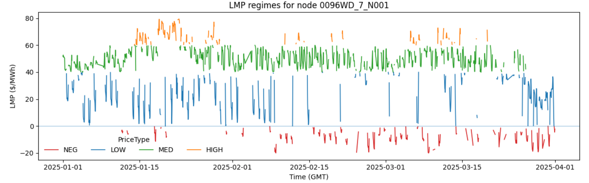
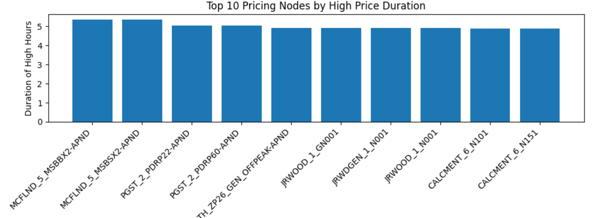
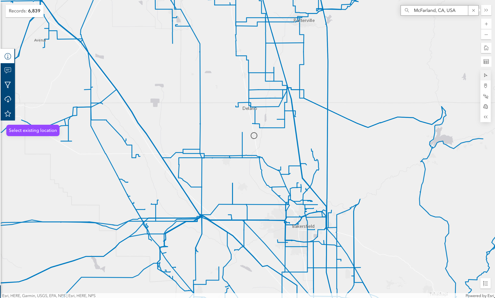
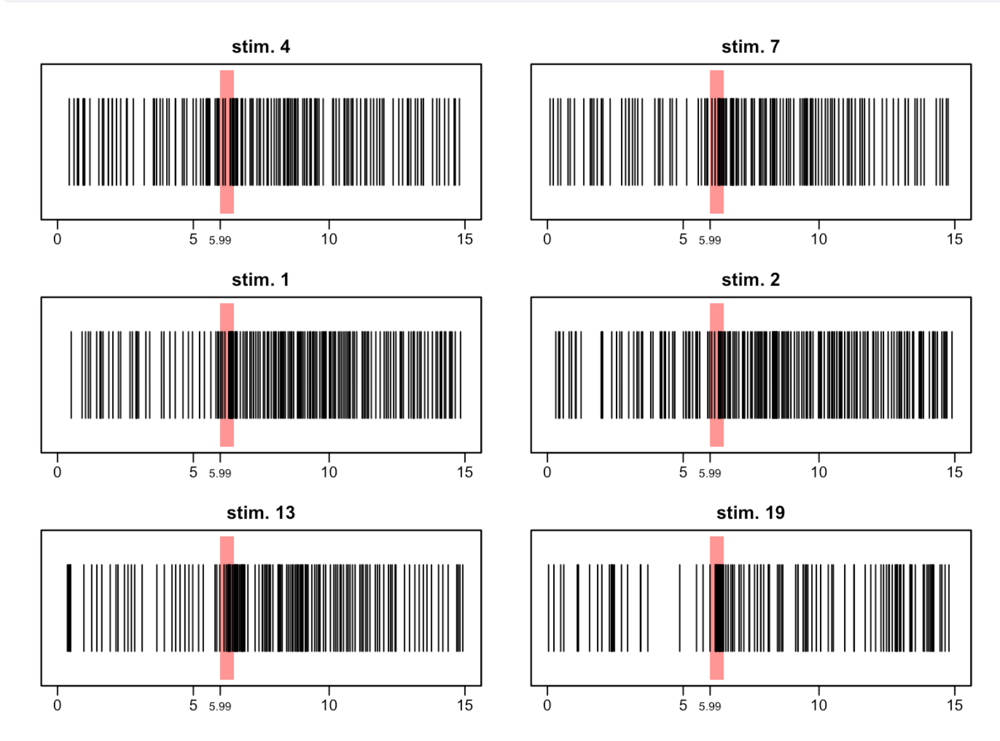
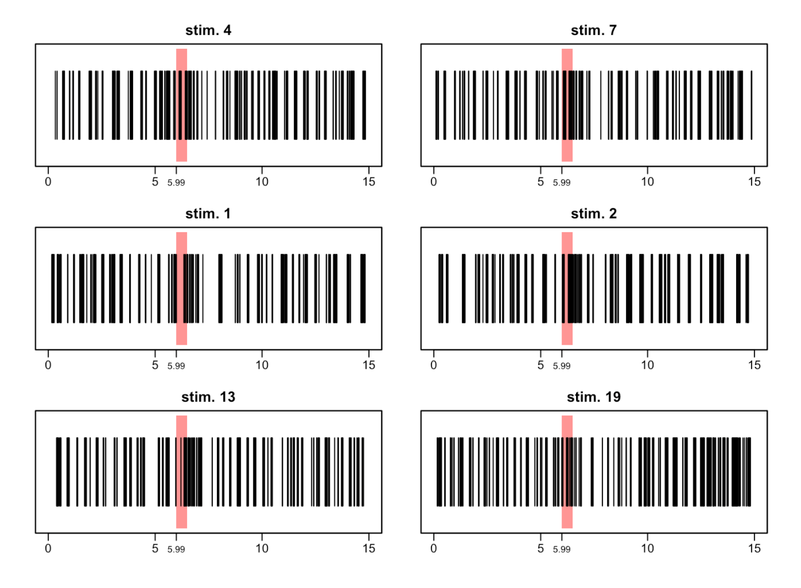
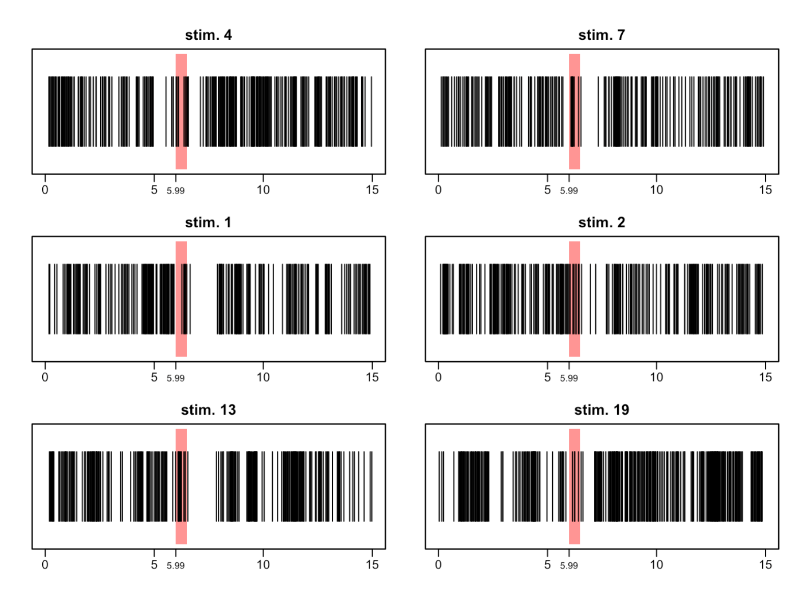

# Stochastic Processes

Coursework, mini-projects, and reference material from **STAT 545 — Stochastic Processes (Winter 2026)**, covering discrete-time Markov chains, MCMC, Poisson processes, and Brownian motion. Everything here is written in LaTeX and compiled to PDF automatically on every push.

**📄 [Read the compiled PDFs →](https://arochaja.github.io/stochastic-processes/)**

[](https://github.com/arochaja/stochastic-processes/actions/workflows/build.yml)

— Andres Efren Rocha Jayasinha

---

## Applied projects

The two mini-projects apply the course material to real data rather than textbook problems.

### 1. Modeling California energy prices as a Markov chain

Built a discrete-time Markov model of wholesale electricity prices from **~35 million rows** of hourly Locational Marginal Price data — every pricing node in CAISO's OASIS feed, January through March 2025.

Prices are discretized into four regimes (`NEG`, `LOW`, `MED`, `HIGH`), a transition matrix is estimated per node, and the expected dwell time in each regime follows from the geometric holding-time identity `E[duration in i] = 1 / (1 - P_ii)`.



Ranking all nodes by expected time spent in the `HIGH` regime surfaced a concrete, physical explanation: the worst-offending nodes cluster around **McFarland, CA**, which sits in a visible gap in the transmission network.

<p align="center">
  
  
</p>

📁 [`projects/caiso-markov-prices/`](projects/caiso-markov-prices) · 💻 [Analysis notebook: `arochaja/CAISO_MARKOV`](https://github.com/arochaja/CAISO_MARKOV)

### 2. Point-process modeling of cockroach antennal lobe neurons

Tested whether citronellal odor puffs change the firing rate of three neurons, modeling each spike train as a **non-homogeneous Poisson process**:

```
Y_it ~ Poisson(λ_i(t) Δt),    log λ_i(t) = β₀ + β₁·stim(t) + f(t) + b_trial
```

with a smooth baseline `f(t)`, a per-trial random effect, and `log Δt` as offset. Plotting `exp(f̂(t))` gives the multiplicative change in firing intensity against a baseline of 1.

<p align="center">
  
  
  
</p>

The stimulus effect is real but **not uniform**: neurons 1 and 2 are excited by the odor, while neuron 3 is suppressed.

📁 [`projects/neural-spike-trains/`](projects/neural-spike-trains) · Joint work with Tyler Stoen and Jose Garcia · 💻 [Analysis code: `tylerstoen/mp2`](https://github.com/tylerstoen/mp2/tree/main)

---

## Assignments

Worked solutions to exercises from Dobrow, *Introduction to Stochastic Processes with R*.

| | Topic | What it covers |
|---|---|---|
| [HW 1](assignments/hw1-markov-chains.tex) | Introduction to Markov chains | Transition matrices, *n*-step probabilities, stochastic matrices with equal rows, gambler's ruin |
| [HW 2](assignments/hw2-stationary-distributions.tex) | Limiting & stationary distributions | Solving `πP = π`, existence and uniqueness, long-run behavior |
| [HW 3](assignments/hw3-recurrence-and-absorption.tex) | Recurrence, transience, periodicity | Communicating-class decomposition, absorbing chains, fundamental matrix, expected absorption times |
| [HW 4](assignments/hw4-metropolis-hastings.tex) | Metropolis–Hastings | Acceptance ratios, detailed balance verification, proposal design |
| [HW 5](assignments/hw5-gibbs-sampler.tex) | Gibbs sampling | Full conditionals, the Bayesian lasso |
| [HW 6](assignments/hw6-poisson-processes.tex) | Poisson processes | Interarrival times, superposition, thinning, conditional uniformity |

## Exam material

| File | Description |
|---|---|
| [`exams/midterm-notesheet.tex`](exams/midterm-notesheet.tex) | Condensed midterm reference: two-state chains, random walks on graphs, absorbing chains, MLE and Laplace/Dirichlet smoothing of transition matrices |
| [`exams/final-notesheet.tex`](exams/final-notesheet.tex) | Two-column final reference sheet — ~45 sections spanning the whole course, from stationary distributions through Brownian bridges and Gibbs sweeps, ending in a problem-solving checklist |
| [`exams/final-practice-rigorous.tex`](exams/final-practice-rigorous.tex) | Full proofs for the eight final practice problems, written for rigor |
| [`exams/final-practice-expanded.tex`](exams/final-practice-expanded.tex) | The same eight problems, worked at length — each step names the theorem used and why it applies |
| [`notes/absorbing-chain-workflow.tex`](notes/absorbing-chain-workflow.tex) | Standalone write-up of the canonical-form → fundamental-matrix → absorption-probability workflow |

## Topics covered

**Discrete-time Markov chains** — transition matrices · communicating classes · recurrence & transience · periodicity · stationary and limiting distributions · detailed balance and reversibility · birth–death chains · reflecting random walks · hitting times · mean return times · random walks on graphs

**Absorbing chains** — canonical form · fundamental matrix `F = (I − Q)⁻¹` · expected time to absorption · absorption probabilities · limiting matrices

**Statistical estimation** — MLE for transition matrices · Laplace smoothing · Dirichlet / empirical Bayes smoothing

**MCMC** — Metropolis–Hastings · Gibbs sampling · Bayesian logistic regression · Bayesian lasso · Gaussian mixture models

**Point & continuous processes** — homogeneous and non-homogeneous Poisson processes · exponential waiting times · thinning and superposition · Brownian motion · Brownian motion with drift · Brownian bridge

---

## Building locally

Each `.tex` file is a standalone document. Figures are referenced relative to the file, so compile from the file's own directory:

```bash
cd projects/caiso-markov-prices && latexmk -pdf writeup.tex
```

To build everything at once:

```bash
find . -name '*.tex' -not -path './.git/*' \
  -exec latexmk -pdf -interaction=nonstopmode -cd {} \;
```

Requires a reasonably complete TeX distribution (TeX Live full or MacTeX) — the documents use `tikz`, `pgfplots`, `tcolorbox`, `tkz-euclide`, and `physics`.

CI runs the same build on every push and publishes the results to [GitHub Pages](https://arochaja.github.io/stochastic-processes/).

## License

Source and figures are released under [CC BY 4.0](LICENSE). Textbook exercise statements quoted in the assignments remain the property of their original publisher.
